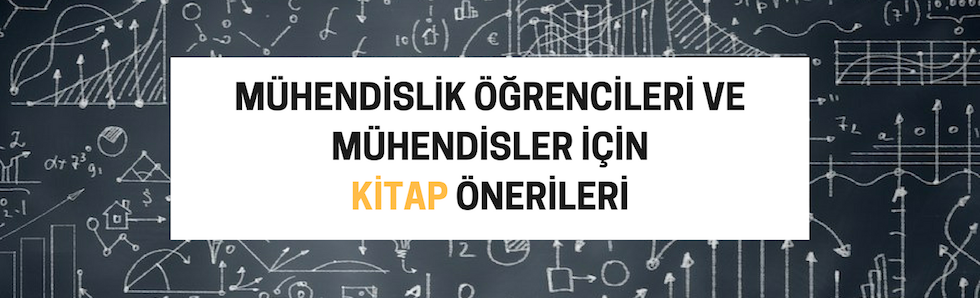

***

:books: Mühendislik öğrencileri ve mühendisler için bilim, tasarım ve iş kitapları öneri listesi :books:

***

Kitap önerilerinizi [Twitter](https://twitter.com/ahmetalpat)'dan ulaştırabilirsiniz.

Kategoriler
-----------------
* [Popüler Bilim](#popüler-bilim)
* [İş](#iş)
* [Tasarım](#tasarım)

:microscope: Popüler Bilim
==========================

:office: İş
===========

:triangular_ruler: Tasarım
==========================

## 👬 Nasıl katkı sağlarım?
- Kitap önerisi yaparak
- Repo için değişiklikler yapıp PR oluşturarak
- Düzeltilmesi gereken noktaları belirterek
- Listeyi elden ele yayarak
